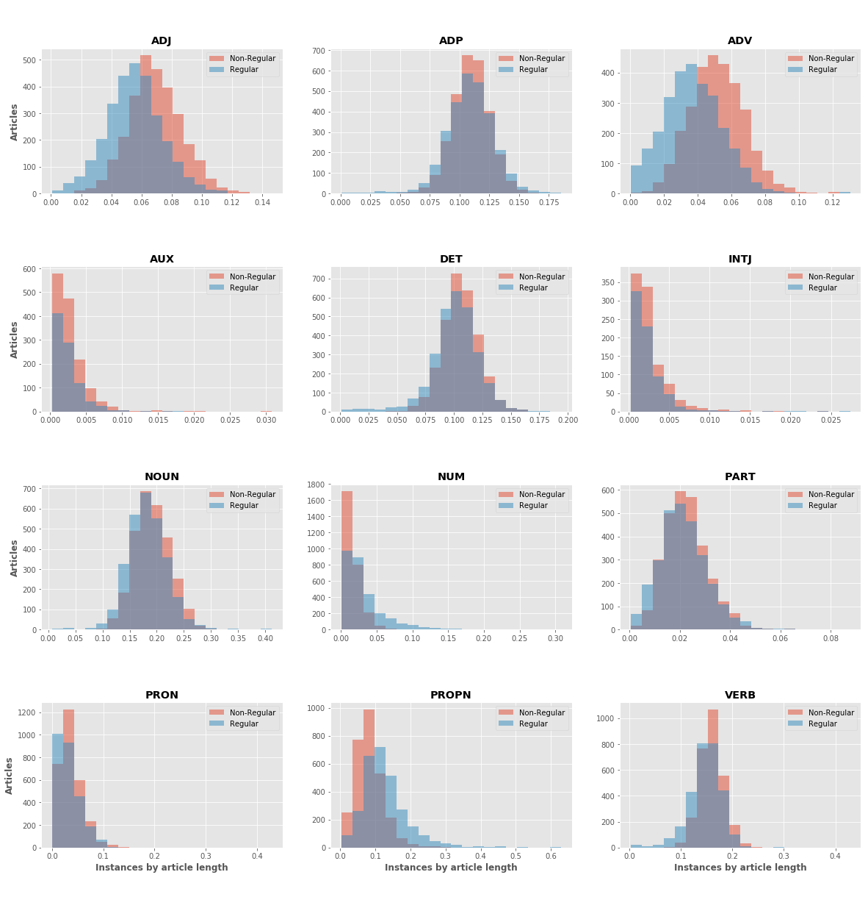

\newpage

# Introduction

  This Capstone project titled "Editorial Classification" is a project worked on by the students of Data Science Institute, Columbia University, under the guidance of industry mentors from Bloomberg and facuty supervisors from the Data Science Institute, Columbia University.

## Project Scope and Primary Objectives
  
The primary objective of the project is to build classifiers for editorial content. It also involves performing quantitative analysis for uncovering this trend across different news sources. The work involved in the project can be divided into 6 different tasks

- Download news Stories from the Provided URL (Data Collection)
- News Content Extraction from News sources (Data Collection)
- Exploratory Data Analysis and Visualisation 
- Common utility to perform a train, dev, test set
- Basic NLP Classification methods
- Standard Deep learning methods for Editorial Classification
- Exploratory topic analysis

\textbf{Change Required ALL-----------------------------------------} link????

## Extended scope and Secondary Objectives

The extended scope of the project involves working on various research mini-projects with the data collected for the primary scope of the project. A select ideas include

- Topic Analysis over Time
- Sentiment Analysis of News Articles
- Report bias in News Sources

These ideas will be worked on once the primary scope of the project is completed. 

\newpage

# Dataset and data collection.

In this section, we talk about the Data collection procedure and News text and feature collection. We also mention the different programing packages and tools that were used for this task

## Initial Dataset

The dataset that was provided to us by the industry mentors consisted of URL, Source and Editorial labels. The data consisted of articles dated from 2008, but most of the articles were as recent as 2018 and 2019.  

The editorial labels. consisted on classes such as  Regular (regular news), Editorial, Oped, Guest (guest editorial), Roundup (multiple editors), and Other (letters to the editor, readers vent). The tags were generated by heuristic-based methods by the mentors. 

The data consisted of news articles from \textbf{Change Required Total how many websites - Sarang had count----------------------------------------} . websites such as New York Times, Washington Post, Washington Observer Report and others. 

## News text and features collection. 

On the advice of the mentors, it was decided that initially, the content and text data from a sample of 10 news sources out of collected. The ten news sources were decided based on the number of non-regular article they had used as to get more data from the non majority label (It was noted that "Regular" news items formed about \textbf{Change Required Total percentah of regular in all websites - Nirali Sarang  ----------------------------------------}  of all labels). The 10 news sources were

- New York Times
- Washington Post
- Washington Observer Report
- Digital Journal
- Enid News
- Californian
- Post-Star	(Later replaced with Press Democrat; reason specified in the subsequent section)
- NW Florida Daily
- Gazette-Mail
- NJSpotlight

The data collection was performed \textit{Python}. For most of the news sources, the data was collected using \textit{requests} package and data processing was done using \textit{BeautifulSoup} package as shown in figure. For others, \textbf{Change Required Aastha----------------------------------------}. The collected data attibutes included article title, date, keywords, article text, and author. The data for each news source was collected and stored seperately

Moreover, we categories all the articles into 2 categories based on their editorial labels . All the news articles under the "Regular" label fall under the \textbf{Regular} category. The rest of the articles under "Editorial", "Oped", "Guest", "Roundup" and "Other" categories are marked as \textbf{Non-regular} category. The articles in the \textbf{Non-regular} category are grouped together as they are primarily opinions of people 

## Ethical Considerations and Omiting Data Sources. 

One ethical constraint that we had to consider was where the website allow extraction of data from their website. While most of the website we picked to extract data allowed us to do so, One of the News source websites, Post-Star, did not allow text extraction and \textbf{Change Required Please check. Aastha ----------------------------------------} Ultimately, we decided to drop the data source. 

\newpage

# Background Research 

 \textbf{Change Required Please check. Ujjwal. Others do you have any other ideas? ----------------------------------------}

\newpage

# Exploratory Data Analysis

As part of the Exploratory Data Analysis (EDA), we explore various attributes that were collected. But our key exploration will be on the text data that was collected from the websites. 

 \textbf{Change Required Please check. Aastha , Nirali, Sarang any other graph ??? ----------------------------------------}
 
 
## Parts of Speech exploration for article text

In this subsection, we look at the distributiion of different parts of speeches in regular and non-regular articles. 

We first calulate an \textit{Instance per article length} metric for each part of speech which evaluates the percentage of terms of that POS which which appear in the article. We then look at the distribution of \textit{Instance per article length} with the count of articles for both regular and non regular articles and do a comparitive analysis

Also, to ensure that the distribution are comparable, we have undersampled the "Regular" class

Our general Hypothesis before this experiment is that the POS speech used in Regular and Non regular articles would be different. We use the \textit{Spacy} package from python for the POS retrieval and \textit{Matplotlib} for the Visualisation

The result of our exploratory analysis on POS is present in Figure \ref{figure:1}. As expected, most of the graphs follow a normal distribution. But there are some striking differences in the distribution of parts of speech in the two classes

Parts of speech like `Adjective` and `Adverbs` seem to be used more frequently used in Non-Regular Articles than in Regular Articles. This is probably because non regular articles (Editorials, Oped, Guest editorial) are generally more opionated than regular articles and are often are more of a "decriptive analysis" of the Nouns (Person/Topic of interest) and Verbs (Action of interest), than factual news items. Similarly, `Determiners`, `Particles`, `Nouns` and `Verbs` are slightly higher as well, but are not that significant. `Interjection` are also quite prominant in Non-regular articles, as they are likely to be more informal and personal

On the other hand, `Numbers` and `Proper-Nouns` are on a higher side in  Regular Articles than in Non-Regular Articles. The explaination is quite obvious in case of `Numbers`, as Regular articles contain more factual information like numbers and quantities than Non-regular articles. It is not obvious in case of `Proper-Nouns`, but we believe that they have a higher share in the article text than in Non-regular news articles because Regular articles talk about a wide range of different (but related) 'subjects' in the same article, but Non-regular opinions do not have that wide of a range of subjects to talk about and stick to a same person of interest (probably the reason they have slightly more of `Pronouns` use than regylar articles)

Note that the bins in the graphs are are left exclusive (i.e the first bin does not include the value 0), So all articles with instance per article length 0 for a particular part of speech will be discarded from the graph

*Note :\textit{The Keys for each of these POS label are present in the Appendix section of the report}

Now, let us look more deeply into all the named entities in the article text

\clearpage

##  Named Entities Recognition and exploration for article text

In this subsection, we look at the distribution of different named entities in regular and non-regular articles. We would primarily be looking at the number of mentions of that entity by the document length and draw a distribution for each entity for both the regular and non-regular articles. 

The data used for this analysis is same as the undersampled data used in the previous analysis. The result of our exploratory analysis is present in Figure \ref{figure:2}.

Unlike the POS section, graphs for Named Entity Recognition were heavily right-skewed for most of the entity types

Non-Regular Articles have high usages of `Law` and `Nationalities` as compared to regular articles in the article text. One reason for `Law` to feature prominently in Non-regular articles may be that Non-Regular articles usually feature an in-depth discussion about a subject, which may refer to many laws as a result. 

On the other hand, `Locations`, `Product`, `Quantity`, `Time` and `Date`  have more prominant presence in Regular Articles than in Non-Regular articles . Intuitively, it makes sense that Location and Quantity feature noticeably higher as Regular article authors usually mention names of location the incident was held and make more factual and numerical mentions in their articles

*Note :\textit{The Keys for each of these Named Entity Recognition labels are present in the Appendix section of the report}

\newpage

# Other Directions 
 \textbf{Change Required Please check. Ujjwal can you please add a summary of the progress in the baseline. Add subsections as required ----------------------------------------}

\newpage

#Future Scope and Next Steps

 \textbf{Change Required Please check. ALL  think about what we can put here ----------------------------------------}

\newpage

# Appendix

## Part of Speech Keys

`ADJ` : Adjective -  word that modifies/describes a noun or noun phrase

`ADP` : Adposition - cover term for prepositions and postpositions

`ADV` : Adverb - word that modifies/describes a verb

`AUX` : Auxiliary verb -  verb that adds functional or grammatical meaning to the sentence

`CONJ` : Coordinating conjunction - a conjunction placed between words, phrases, clauses, or sentences

`DET` : Determiner - word that serves to express the reference of a noun

`INTJ` : Interjection - Word or expression that expresses a spontaneous feeling or reaction

`NOUN` : Noun -  word that functions as the name of some specific thing or set of things

`NUM` : Numeral - Numbers and figures 

`PART` : Particle - word with traditional meaning

`PRON` : Pronoun -  word that substitutes for a noun or noun phrase

`PROPN` : Proper noun -  noun that identifies a single entity 

`PUNCT` : Punctuation - punctuation marks such as comma, period, parentheses, etc. 

`SCONJ` : Subordinating conjunction - a conjunction that introduces a subordinate clause

`SYM`: symbol - Special Symbols

`VERB` : verb - word used to describe an action, state, or occurrence

## Named Entity Recognition Keys

`PERSON`:	People, including fictional.

`NORP`:	Nationalities or religious or political groups.

`ORG`:	Companies, agencies, institutions, etc.

`LOCATION`:	mountain ranges, bodies of water, counter, cities, states, 
buildings, airports, highways, bridges, etc.

`PRODUCT`:	Objects, vehicles, foods, etc. (Not services.)

`EVENT`:	Named hurricanes, battles, wars, sports events, etc.

`WORK_OF_ART`:	Titles of books, songs, etc.

`LAW`:	Named documents made into laws.

`LANGUAGE`:	Any named language.

`DATE`:	Absolute or relative dates or periods.

`TIME`:	Times smaller than a day.

`PERCENT`:	Percentage, including "%".

`MONEY`:	Monetary values, including unit.

`QUANTITY`:	Measurements, as of weight or distance.

`ORDINAL`:	"first", "second", etc.

`CARDINAL`:	Numerals that do not fall under another type.

