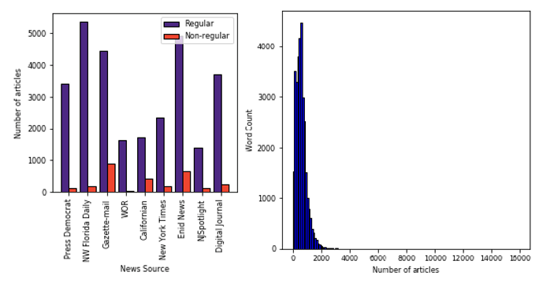
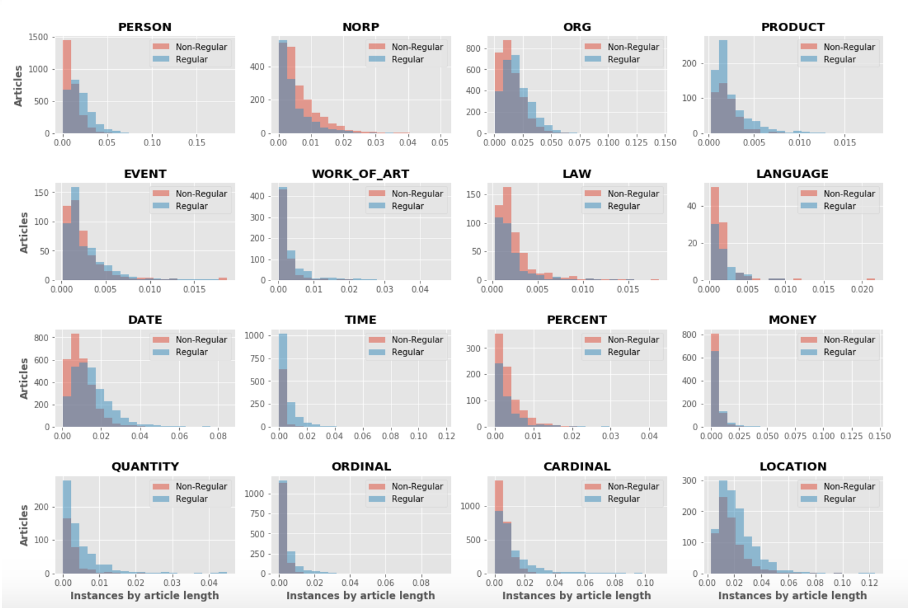

\newpage

# Introduction

  This Capstone project titled "Editorial Classification" is a project worked on by the students of Data Science Institute, Columbia University, under the guidance of industry mentors from Bloomberg and facuty supervisors from the Data Science Institute, Columbia University.

## Project Scope and Primary Objectives
  
The primary objective of the project is to build classifiers for editorial content. It also involves performing quantitative analysis for uncovering trends across different news sources. The work involved in the project can be divided into 7 different tasks

- Download news Stories from the Provided URL (Data Collection)
- News Content Extraction from News sources (Data Collection)
- Exploratory Data Analysis and Visualisation 
- Build a common utility to split the collected data into train, dev, test sets 
- Basic NLP Classification methods
- Standard Deep learning methods for Editorial Classification
- Exploratory topic analysis

## Extended scope and Secondary Objectives

The extended scope of the project involves working on various research mini-projects with the data collected for the primary scope of the project. A select ideas include

- Topic Analysis over Time
- Sentiment Analysis of News Articles
- Reporting bias in News Sources and media reliability 

These ideas will be worked on once the primary scope of the project is completed. 

\newpage

# Background Research 

In this section, we discuss some of the background research that was conducted and literature that was reviewed in order to start with the project in an effective manner. 

## Early Research

Some of the earliest and most popular work that was conducted on news articles was conducted by Ken Lang [1], who built a system called NewsWeeder, and people who would use the platform would get recommended news articles based on how they rate each article. This paper was one of the first usages of *TF-IDF*, among others ,for classification techniques, and built a *bag-of-words* model as a representation of each news article. It also introduced the *20 Newsgroups* dataset, which is a collection of 20,000 news documents. This dataset is one of the most popular news datasets. 

## Train-Test Split and Model evaluation

One of the most important parts while training a model is the train-test split. It needs to be chosen in such a way that it provides enough data to the model to make it feature-rich, keep the model representative of the original targets which the model has to classify, and at the same time, make it flexible for any future changes in the data. Hence, walk-forward cross validation is one of the best and most robust techniques for validating the model performance, as suggested by Roger Stein [2], Tomas Dvorak [3], and tested by Jason Brownlee [4]. This would have been the best approach to train-test splitting and model evaluation, however, due to the absence of news articles before 2018, save for a few, this approach was discarded for the initial analysis and K-Fold Validation was used for testing any model performance and tuning any hyperparameters.

## Baseline model building

There are a lot of articles which discuss model building in order to build an iniital classifier on textual data, and the one that we went with was by Shivam Bansal [5], which explored the multiple features which can be created for an ensemble model and how that can be used to classify text. It also builds CNNs, RNNs and Bidirectional RNNs, each of which have their own advantages. CNNs focus on a localized word level featurization, which might be something that can easily differentiate between our targets. RNNs and Bidirectional RNNs exploit the sequential nature of textual interations and the grammar of the language in order to find out differences in labels. 

## Exploratory Data Analysis

For exploration of the dataset, we looked at Parts-of-Speech tagging, Named Entity Resolution and other features which can also be included in our models as a feature. Spacy has very well documented examples which explain how to use their APIs for POS tagging and NER [[7]](https://spacy.io/usage/linguistic-features), and built on these features.

\newpage

# Dataset and data collection.

In this section, we talk about the Data collection procedure and News text and feature collection. We also mention the different programing packages and tools that were used for this task

## Initial Dataset

The dataset that was provided to us by the industry mentors consisted of URL, Source and Editorial labels. The data consisted of articles dated from 2008, but most of the articles were as recent as 2018 and 2019. The editorial labels. consisted on classes such as  Regular (regular news), Editorial, Oped, Guest (guest editorial), Roundup (multiple editors), and Others. The data consisted of news articles from 95 websites such as New York Times, Washington Post, etc. 

## News text and features collection. 

On the advice of the mentors, it was decided that initially, the content and text data from a sample of 10 news sources out of collected. The ten news sources were decided based on the number of non-regular articles they had, as to get more data from the minority labels (It was noted that "Regular" labelled news items formed about 99.1% of all labels). The 10 news sources were

- New York Times
- Washington Post
- Washington Observer Report
- Digital Journal
- Enid News
- Californian
- Post-Star	(Later replaced with Press Democrat; reason specified in the subsequent section)
- NW Florida Daily
- Gazette-Mail
- NJSpotlight

The data collection was performed \textit{Python}. For most of the news sources, the data was collected using \textit{requests} package and data processing was done using \textit{BeautifulSoup} package. For others, \textit{Selenium} was used as the pages were being dynamically loaded using Javascript which was making it difficult to use \textit{BeautifulSoup} alone. The collected data attibutes included article title, date, keywords, article text, and author. The data for each news source was collected and stored seperately

Moreover, we categorize all the articles into 2 categories based on their editorial labels. Articles under the "Regular" label fall under the \textbf{Regular} category.Whereas, the rest fall under of the articles under \textbf{Non-regular} category, which consists of "Editorial", "Oped", "Guest", "Roundup" and "Other" labels. These are grouped together as they are primarily opinions of people (News paper editors, Columnists, Prominent guests)

## Ethical Considerations and Omiting Data Sources. 

One ethical constraint we had to consider was whether the websites allow extraction of data from their website. While most of the website we picked to extract data allowed us to do so, one of the news source websites, \textbf{Post-Star}, did not allow text extraction by generating quizzes on the fly. This made it difficult for us to extract this data. So we decided not to extract text from this website due to ethical considerations. And ultimately we decided to drop the data source from our dataset.

\newpage

# Exploratory Data Analysis

As part of the Exploratory Data Analysis (EDA), we explore various attributes that were collected. But our key exploration will be on the text data that was collected from the websites. 

## Visualizing Authors

 

In Figure \ref{aut:1} we have tried to visualise the top contributing news sources for op-ed articles. This helps us understand the category of articles that each publishing house promotes more. Further we have tried to visualise the top authors contributing to the Oped articles of Digital Journal. The top authors we found are Ken Helly, Paul Willis, Karen Graham, Markos Pappados and Tim Sandle. This depicts that some authors have a tendency towards publishing op-ed articles. 
Similar visualisations were performed for other sources too. 

## Visualizing categories of articles across news sources

 
In this sub-section, we visualize the number of articles published in various categories across the 10 news sources that we have worked on.  For the purpose of this visualization, we have divided the articles into 2 major categories namely \textbf{Regular} and \textbf{Non-regular}.

 

As seen in Figure \ref{fig:1}(a), we could derive that our dataset is imbalanced with a majority of regular articles. Thus, to build a model that can accurately classify news articles, it is important to balance the dataset to ensure that our model does not predict the majority class by default. This visualization was key to determine that preprocessing techniques like downsampling and upsampling had to be applied to the data before building a model.

## Distribution of article length across news sources

This sub-section focuses on cleaning the dataset based on the length of the news articles. To achieve this goal, we developed a visualization that depicted the distribution of article length across the 10 news sources we have worked on.

As seen in the Figure \ref{fig:1}(b), the 95% confidence interval range for the article length is [100,2000]. Few articles were more than 2000 words long and very few of them had a word count greater than 3000. The range on the x- axis of the plot shows presence of some articles containing more than 5000 words and upto 16000 words. This derived insight suggested elimination of articles with a word count outside the 95% confidence interval.

As a part of further inquisition, we checked the word count distribution for individual sources to figure out if the distribution shown above was heavily impacted by some news sources. Below is a plot showing the distribution of word count for every news source.

{width=300px}

Graph\ref{fig:3} shows that New York Times generally publishes articles that are upto 5000 words long.  All other news sources publish most articles with a word count of upto 2000. This proved that we could clean our dataset further based on word count of articles without losing too much information.

## Parts of Speech exploration for article text

In this subsection, we look at the distribution of different parts of speeches in \textbf{Regular} and \textbf{Non-regular} articles. 

We first calulate an \textit{Instance per article length} metric for each part of speech which evaluates the percentage of terms of that POS which which appear in the article. We then look at the distribution of \textit{Instance per article length} with the count of articles for both Regular and Non-regular articles and do a comparitive analysis

Also, to ensure that the distribution are comparable, we have undersampled the \textbf{Regular} class

Our general Hypothesis before this experiment is that the POS speech used in \textbf{Regular} and \textbf{Non-regular} articles would be different. We use the \textit{Spacy} package from python for the POS retrieval and \textit{Matplotlib} for the Visualisation

The result of our exploratory analysis on POS is present in Figure \ref{figure:1}. As expected, most of the graphs follow a normal distribution. But there are some striking differences in the distribution of parts of speech in the two classes

Parts of speech like `Adjective` and `Adverbs` seem to be used more frequently used in \textbf{Non-Regular} Articles than in \textbf{Regular} Articles. This is probably because Non-regular articles (Editorials, Oped, Guest editorial) are generally more opionated than Regular articles and are often are more of a "decriptive analysis" of the Nouns (Person/Topic of interest) and Verbs (Action of interest), than factual news items. Similarly, `Determiners`, `Particles`, `Nouns` and `Verbs` are slightly higher as well, but are not that significant. `Interjection` are also quite prominant in \textbf{Non-regular} articles, as they are likely to be more informal and personal

On the other hand, `Numbers` and `Proper-Nouns` are on a higher side in  \textbf{Regular} Articles than in \textbf{Non-Regular} Articles. The explaination is quite obvious in case of `Numbers`, as Regular articles contain more factual information like numbers and quantities than Non-regular articles. It is not obvious in case of `Proper-Nouns`, but we believe that they have a higher share in the article text than in Non-regular news articles because Regular articles talk about a wide range of different (but related) 'subjects' in the same article. But \textbf{Non-regular} opinions do not have that wide of a range of subjects to talk about and stick to a same person of interest (probably the reason they have slightly more of `Pronouns` use than \textbf{Regular} articles)

Note that the bins in the graphs are are left exclusive (i.e the first bin does not include the value 0), So all articles with instance per article length 0 for a particular part of speech will be discarded from the graph

*Note :\textit{The Keys for each of these POS label are present in the Appendix section of the report}

Now, let us look more deeply into all the named entities in the article text

##  Named Entities Recognition and exploration for article text

In this subsection, we look at the distribution of different named entities in \textbf{Regular} and \textbf{Non-regular} articles. We would primarily be looking at the number of mentions of that entity by the document length and draw a distribution for each entity for both the Regular and Non-regular articles. 

The data used for this analysis is same as the undersampled data used in the previous analysis. The result of our exploratory analysis is present in Figure \ref{figure:2}.

Unlike the POS section, graphs for Named Entity Recognition were heavily right-skewed for most of the entity types

\textbf{Non-Regular} Articles have high usages of `Law` and `Nationalities` as compared to \textbf{Regular} articles in the article text. One reason for `Law` to feature prominently in Non-regular articles may be that Non-Regular articles usually feature an in-depth discussion about a subject, which may refer to many laws as a result. 

On the other hand, `Locations`, `Product`, `Quantity`, `Time` and `Date`  have more prominant presence in \textbf{Regular} articles than in \textbf{Non-regular} articles . Intuitively, it makes sense that Location and Quantity feature noticeably higher as Regular article authors usually mention names of location the incident was held and make more factual and numerical mentions in their articles

*Note :\textit{The Keys for each of these Named Entity Recognition labels are present in the Appendix section of the report}

\newpage

# Current Progress 

The target of the project involves distinguishing between regular and editorial news using machine learning models. Hence there is a need for a baseline model which would form a performance barrier over which future models would iteratively improve. After referring to our advisers, it was decided that our baseline would be a model which would utilise feature extractions such as sentiments, word counts, and TF-IDF representations. The preparation of this model involved the following steps

## Data Preprocessing

First, the usual text preprocessing algorithms like case conversion, stop word removal, punctaution removal were applied on the text data. Stemming and Lemmatization was performed on the text data as well. We also converted the numbers to strings. Also, the targets were clearly defined in this step. A news article with the label of 0 or Regular was given a target of \textbf{0}. A news article with a labels of "Opinion", "Op-ed", "Guest"", "Editorial", "Other", "1" and "2" were given a target of \textbf{1}, in order to simplify the baseline model.
 
## Feature extraction and Model Training 

Features used in the model are Word counts(top 1000 features), TF-IDF Word scores (top 1000 features), Sentiment extraction using VADER, and AFINN and Average word length

The model was trained on a LightGBM model with all parameters set to default. No cross validation for hyperparameter tuning was conducted, as it was taking a lot of time to execute.

## Evaluation of the model
The model was evaluated with a train-test split of 80-20. The model performance was evaluated using metrics like Accuracy, Precision, Recall, F1 score, Area under ROC curve, Brier score and Average precision

ROC curve, average precision plot, confusion matrix, and feature importance plots were also built to analyse the performance of the model on the test set, which can be observed below:

As can be seen in Figure 6, while the baseline model is performing good, there is a huge scope of improvement. 

\newpage

# Next Steps

## Classification using Deep Learning

In order to classify our news articles we plan to use state-of-the art pre-trained BERT model[6]. BERT uses a multi-layer bidirectional transformer encoder to learn contextual representation between words within a text. The transformer reads the entire sequence of words at once to learn context of word based on all of its surrounding words (left and right). The input while training BERT is a sequence of tokens embedded into a vectors and processed in a neural network. The output is a sequence of vectors where each vector corresponds to input token. 

BERT algorithm uses 2 training strategies where the goal is to minimise the combined loss function of both the strategies:-

- Masked LM - 15% of words in each sequence replaced with mask token. The model tries to predict original value of masked word based on context provided by non-masked words.
- Next sentence prediction - Model gets a pair of sentences as input and learns to predict if second sentence in pair is subsequent sentence in original document. 50% of sentences chosen where the second sentence is actually following the first sentence whereas the remaining 50% are where the second sentence is chosen randomly.  

We plan to tune the final layer of the pretrained model to classify our News Articles

## Topic Modeling

It would be useful to discover hidden semantic structures in article content using a text-mining tool called Topic Modeling. Developing a topic model can aid us in extracting abstract topics from a collection of articles. To perform Topic Modeling, we would use Latent Dirichlet Allocation (LDA) because it is based on the assumption that each document in a corpus is a combination of topics inferred across all the documents. The topic structure being unknown, it observes documents and their content and uses it to infer the topic structure. [7] Using this technique, we can figure out if some news sources and authors tend to publish articles based on a certain set of topics. This can also help us to figure out the most common topics as well as the most frequently used words within the topic. It can be used to model topics as a mixture of words and documents as a mixture of topics. Thus, LDA can prove to be useful in analyzing trends and patterns in news articles.

## Sentiment Analysis (Extended Scope)

It would be interesting to perform sentiment analysis or opinion mining using natural language processing, text mining and computational linguistics to determine the emotional state of the writer and perform stylistic analysis to capture the writing style and tone in articles that can differentiate between types of articles as well as authors. We would use VADER, a part of NLTK [9] to extract these sentiments. This can also be used to model how different news sources frame their content for maximum impact. [10]. Semantic analysis could be used to extract the general tone of the article like agreement, evaluation, disagreement, attack and appraisal to name a few. [11]
\newpage

# References

[1] NewsWeeder: Learning to filter netnews

https://pdfs.semanticscholar.org/26fd/e7f657b41be65a0b975615508f4f100e3a04.pdf

 

[2] Benchmarking default prediction models: pitfalls and remedies in model validation http://www.rogermstein.com/wp-content/uploads/BenchmarkingDefaultPredictionModels_TR030124.pdf

 

[3] Why isn't out of time validation more ubiquitous?
https://towardsdatascience.com/why-isnt-out-of-time-validation-more-ubiquitous-7397098c4ab6

 

[4] How to backtest machine learning models for time series forecasting
https://machinelearningmastery.com/backtest-machine-learning-models-time-series-forecasting/

 

[5] A comprehensive guide to implement and understand text classification in python

https://www.analyticsvidhya.com/blog/2018/04/a-comprehensive-guide-to-understand-and-implement-text-classification-in-python/

 

[6] spaCy
https://spacy.io/usage/linguistic-features

 

[7] BERT: Pre-Training of Deep Bidirectional Transformers for Language Understanding
https://arxiv.org/pdf/1810.04805.pdf

[8] Quantitative analysis of large amounts of journalistic texts using topic modeling
https://www.tandfonline.com/doi/abs/10.1080/21670811.2015.1093271

 

[9] NLTK
https://www.tandfonline.com/doi/abs/10.1080/21670811.2015.1093271

 

[10] An empirical exploration of moral foundations theory in Partisan news sources
https://www.sas.upenn.edu/~danielpr/files/mf2016lrec.pdf

 

[11] Analyzing the semantic types of claims and premises in an online persuasive forum
http://www.cs.columbia.edu/nlp/papers/2017/hidey_semantic_arguments.pdf

\newpage

# Appendix

## Part of Speech Keys

`ADJ` : Adjective -  word that modifies/describes a noun or noun phrase

`ADP` : Adposition - cover term for prepositions and postpositions

`ADV` : Adverb - word that modifies/describes a verb

`AUX` : Auxiliary verb -  verb that adds functional or grammatical meaning to the sentence

`CONJ` : Coordinating conjunction - a conjunction placed between words, phrases, clauses, or sentences

`DET` : Determiner - word that serves to express the reference of a noun

`INTJ` : Interjection - Word or expression that expresses a spontaneous feeling or reaction

`NOUN` : Noun -  word that functions as the name of some specific thing or set of things

`NUM` : Numeral - Numbers and figures 

`PART` : Particle - word with traditional meaning

`PRON` : Pronoun -  word that substitutes for a noun or noun phrase

`PROPN` : Proper noun -  noun that identifies a single entity 

`PUNCT` : Punctuation - punctuation marks such as comma, period, parentheses, etc. 

`SCONJ` : Subordinating conjunction - a conjunction that introduces a subordinate clause

`SYM`: symbol - Special Symbols

`VERB` : verb - word used to describe an action, state, or occurrence

## Named Entity Recognition Keys

`PERSON`:	People, including fictional.

`NORP`:	Nationalities or religious or political groups.

`ORG`:	Companies, agencies, institutions, etc.

`LOCATION`:	mountain ranges, bodies of water, counter, cities, states, 
buildings, airports, highways, bridges, etc.

`PRODUCT`:	Objects, vehicles, foods, etc. (Not services.)

`EVENT`:	Named hurricanes, battles, wars, sports events, etc.

`WORK_OF_ART`:	Titles of books, songs, etc.

`LAW`:	Named documents made into laws.

`LANGUAGE`:	Any named language.

`DATE`:	Absolute or relative dates or periods.

`TIME`:	Times smaller than a day.

`PERCENT`:	Percentage, including "%".

`MONEY`:	Monetary values, including unit.

`QUANTITY`:	Measurements, as of weight or distance.

`ORDINAL`:	"first", "second", etc.

`CARDINAL`:	Numerals that do not fall under another type.

# Contributions (Alphabetical order)

## Work 

- Data Collection - Aastha, Ameya, Nirali, Sarang, Ujjwal
- Exploratory Data Analysis - Aastha, Ameya, Nirali, Sarang
- Baseline Model - Ujjwal

## Report

- Introduction -  Ameya
- Background Reseach - Ujjwal
- Data Collection -  Aastha, Ameya, Nirali 
- Exploratory Data Analysis - Aastha, Ameya, Nirali, Sarang
- Current Progress - Ujjwal
- Next Steps - Aastha, Nirali
- Appendix - Ameya, Sarang

