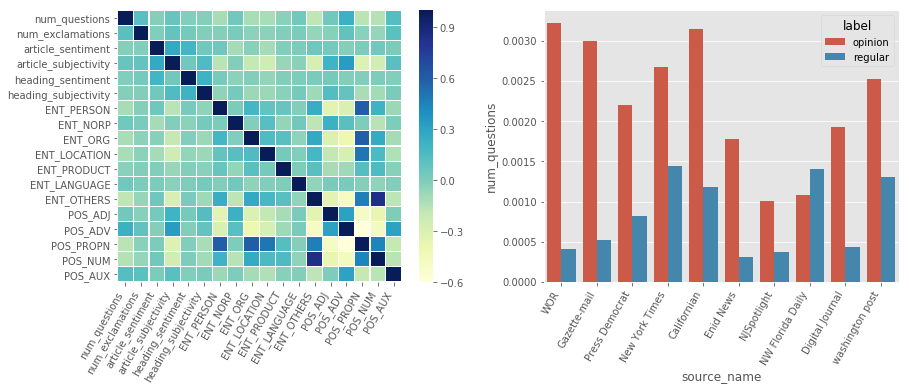
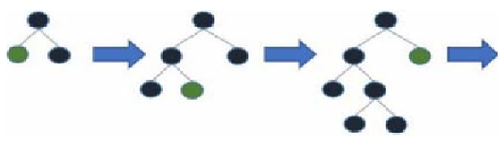
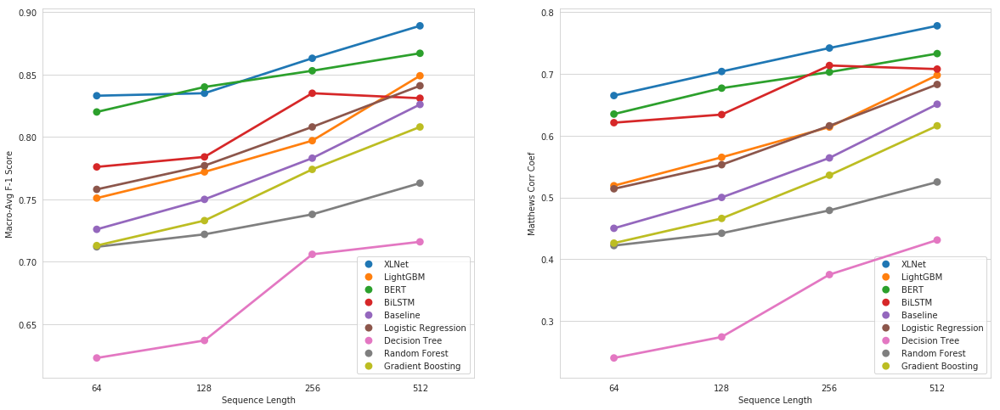
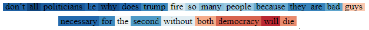
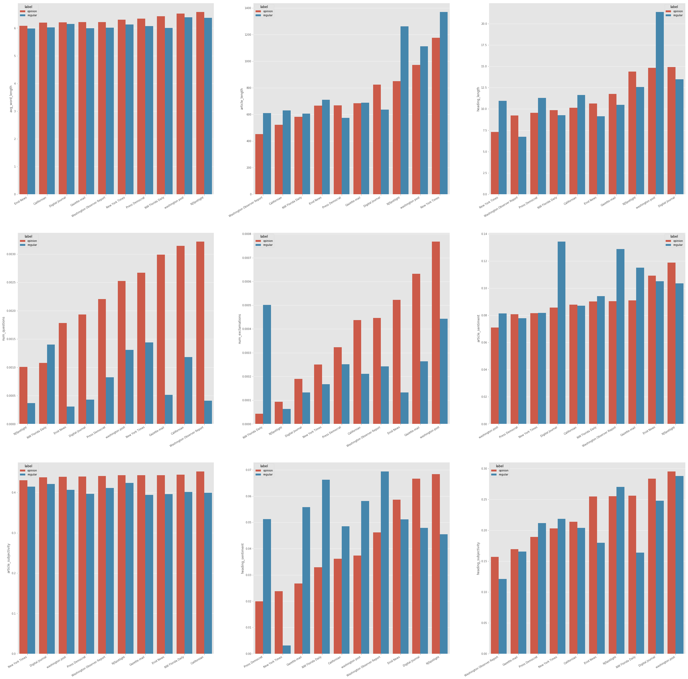
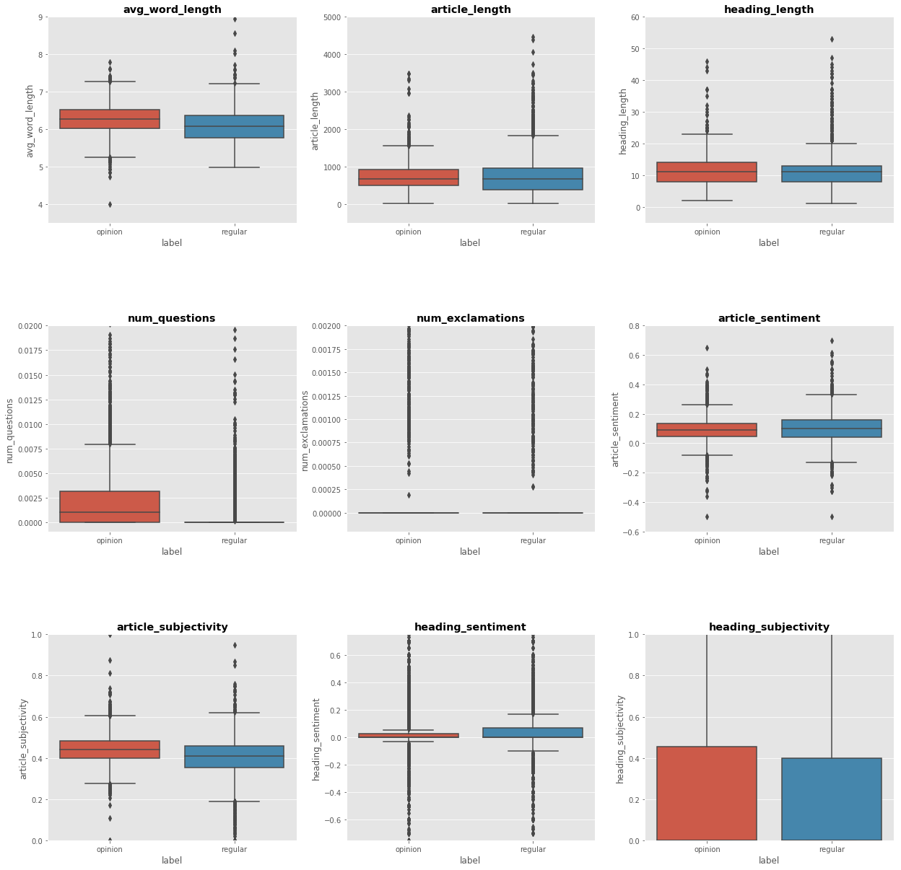

```{r setup, include=FALSE}
knitr::opts_chunk$set(echo = TRUE, fig.pos= "h")
```

\newpage

\pagenumbering{arabic}

# Feedback from Report 1

In this section, we look at how the feedback recieved from mentors was incorporated in the project.

## Article text exploration (Named Entity and Parts of Speech)

Along with the visualization depicting the distribution of Regular and Opinion articles (Refer Report 1 and Appendix), we look at statistics around important NER/POS. We see that the statistics have distinct means in the context of regular and opinion articles, but we cannot claim that they have a different distribution due to high stddev values. Nonetheless, we can take them as features. Refer to the Appendix for the statistics pertaining to all Parts of Speech and Named entities.

```{r pressure, echo=FALSE, , out.width = '100%', fig.align="center"}
knitr::include_graphics("images/pos_ner_tab.png")
```


## Correlation Analysis among Article Features

We conducted a covariance analysis to examine how different features of the articles relate to each other and the target variable. Some significant correlations are visible in the matrix. For instance, the POS tag for proper nouns is significantly correlated with PERSON and ORG NER tag. This makes sense as person and org names are more likely to be proper nouns than common nouns.

There are some significant correlations between article features and the target variable (Figure 1). Opinion articles, in general, have a higher number of questions (normalized for article-length) as compared to regular articles. Similarly, regular articles are longer in length than opinion articles. For the analysis of other features, please refer to the Appendix.


```{r corr, echo=FALSE, , out.width = '90%', fig.align="center", fig.cap="(a) Covariance between features  (b) Normalised number of questions by source"}

```

\newpage
# Data Preparation

In this section, we look at the data preparation process that was employed. This was a subsequent step to the data collection step. This was a step that would prepare the data for input into the ensemble and deep learning models. The data preparation module involved a two-pronged approach:

## Train-test split and handling class imbalance

### Train-Test split

The train and testing splits were carried out in a temporal fashion to ensure that the testing would be on a future data set and the model would be robust to future datasets. Hence, the training data would encompass 90% of the original data set and the testing would be the remaining 10%. A date was selected such that 90% of the data set before that date would become our training dataset and after that would become our testing dataset. 

### Undersampling
Then, undersampling was carried out on the training data set to ensure that the balance of both the classes was equal. The undersampling would ensure that for every article of our 1 class on the same date, there would be an equivalent 0 class in the training set of the same day. A look back - look forward paradigm was implemented to pick an equivalent 0 class if it wasn't available on the same day. 

## Text Processing and Feature Creation 

### Text Preprocessing
Additional preprocessed text was generated in order to aid the generalizability of the models. The various steps include converting numbers to strings, lowercase conversion, stopword removal, short word removal, stemming / lemmatization, expansion of contractions and punctuations removal.

### Feature creation

Features were extracted from both raw articles and processed text and headlines to be fed into our machine learning models. General-purpose text features included average word length and sentiment (using VADER, AFINN, and TextBlob) of the article (both retrieved from the processed text). Other features retrieved from the raw articles include heading text, heading length, article length, number of punctuations (question marks and exclamations), subjectivity (using TextBlob) and normalized counts of Named Entity Recognition (NER) and Parts-of-Speech (POS) tags (using SpaCy). Data-specific text features included vectorized text (character and word-based) using Count and Tf-Idf vectorizers. N-gram ranges of (1, 2) and (1, 3) were used for both the vectorizers.

Refer to the Appendix for further details about each of the features. 


The final test train split is as shown in the table below
```{r tts, echo=FALSE, , out.width = '100%', fig.align="center"}
knitr::include_graphics("images/train-test.png")
```
\newpage

# Models

In this section, we discuss the different models that were picked and trained on the data.

## Baseline model

For the baseline, we used a simple logistic regression model with a CountVectorizer. CountVectorizer provides a simple way to not only tokenize a collection of text documents and build a vocabulary of known words but also to encode new documents using that vocabulary.

To display and compare the results of the baseline with all the other models, we run all the models on first 64, 128, 256 and 512 words. 

## Linear and Ensemble models

The following general classification models were used

- Logistic Regression (with TF-IDF)
- Decision Tree
- Random Forest
- Gradient Boosting

The models were run using python's \textit{scikit-learn} package. The description of parameters is given in the Appendix.


To get the best out of the algorithms, we tuned parameters.

- C, penalty (Logistic regression)
- n_estimators, max_depth ( Random Forest)
- max_depth (Decision Tree)
- n_estimators, max_depth, learning_rate (Gradient Boosting)

### LightGBM

Along with a simple Gradient Boosting Classifier, we also decided to try LightGBM (Ke et al., 2017) as it is frequently used in Kaggle competitions, and it trains fast and gives better performance than other ensemble models. LightGBM is a really fast and distributed ensemble model that is primarily based on decision trees. It splits the trees leaf-wise instead of tree-depth wise or level-wise (Figure 2). Hence, it leads to faster training time and more reduction in loss (Daoud, 2019). 


```{r lightgbm, echo=FALSE, , out.width = '100%', fig.align="center", fig.cap="LightGBM Leaf-wise tree growth"}

```

LightGBM uses Gradient-based One-Side Sampling to find which value to split on, which is faster than a Histogram-based approach for finding splits. So, it keeps all instances which lead to higher gradients, and then randomly samples instances which have a lower gradient. The assumption here is that those samples with lower gradient have a smaller training error, and hence the model is already tuned to those samples. 

The parameter tuned for LightGBM were max_depth, num_leaves, n_estimators, and learning_rate. The description of parameters is given in the Appendix.


## Recurrent Neural Networks and LSTM

Recurrent Neural Networks (RNN) are neural networks where connections between nodes form a directed graph along the time dimension. This allows information to persist over time. Long Short Term Memory Networks (LSTM) (Hochreiter et al., 1997; Olah, 2015; Karpathy, 2015) are a special class of RNN capable of learning temporal dependencies. They are designed to ensure that the long term dependency problem of RNN is avoided using forget gate.

The input text is pre-processed & converted to the tokenised format. After pre-padding it for various article lengths like 64, 128, 256 & 512 words it is fed to an Embedding layer. The weights used for the embedding layer are Glove (Pennington et al., 2014) 300-dimensional word vectors. They have been pre-trained on Wikipedia 2014 text corpus.


### Bidirectional LSTM 

Bidirectional LSTM (BiLSTM) is type of LSTM model that connects 2 hidden layers of opposite directions to the same output. The neurons of a regular RNN are split in 2-time directions, one for forwarding states & other for backward states (Schuster et al., 1997). Outputs from both states are not connected. Instead, they are concatenated at each time step. This helps take into consideration the future input information for prediction. The input sequence is fed in normal time order for one network, & in reverse time order for another. 


### Model architecture 

The general model architecture used is LSTM/BiLSTM layer with 64 hidden units. The LSTM/BiLSTM layer has been regularised by using dropout (p=0.2) & recurrent dropout (p=0.1) on hidden layers. The next layer used is a global Max pooling layer. It is followed by a dense layer of 64 units with 'relu' activation. Next, a dropout layer with dropout percentage p=0.5 is used. Dropout helps improve model generalizability & prevent model overfitting. The last layer is a Dense layer with softmax activation to give a probabilistic output score for article classification.

### Bidirectional LSTM with Attention

For our dataset, we observed that training BILSTM led to a higher macro F1 score than the LSTM model. To further improve BiLSTM, word-level attention was incorporated. It is observed that different words & sentences in a document are differentially informative. Attention uses context to discover when a sequence of tokens is relevant rather than simply filtering for sequences of tokens taken out of context (Yang et al., 2016; Vaswani et al., 2017).

### Multi-input Bidirectional LSTM 

A Multi-input BiLSTM model was developed. The 2 inputs to the model are article heading & text. Both input sources were trained separately on the same model architecture (Refer to Section 3.3.2). The results were concatenated & the final vector passed through a dense layer with softmax activation function to predict the final class probabilities.


## BERT

\textbf{B}idirectional \textbf{E}ncoder \textbf{R}epresentations from \textbf{T}ransformer (BERT) is a deep language understanding model released by Google in late 2018. BERT uses a multi-layer bidirectional transformer encoder to learn contextual representation between words within a text. Unlike Bidirectional LSTM which is trained both from left-to-right and right-to-left to predict the next and the previous words independently, BERT looks at both the ways at the same time - the model is made to learn from the entire sentence.

### Model Architecture

Instead of using Recurrent Neural Network Architecture mechanism to model sequences, BERT incorporated a Transformer in its architecture, which uses the attention mechanism over the input sequence (Singh, 2019). Attention allows the model to focus on relevant parts of the input sequence as needed (Alammar, 2018).

The input to the model is a combination of position embeddings (to represent the position of words in a sentence), segment embeddings (to represent the position of sentences in text comprising of multiple sentences) and token embeddings. BERT uses a WordPiece tokenizer which reduces the size of the vocabulary significantly and helps cover a wide spectrum of out-of-vocabulary words.

The original BERT paper presents two model sizes:

-	BERT Base: A lighter version of the model with 110M parameters and 12 layers
-	BERT Large: Full-size model with 340M parameters and 24 layers

### Model Training

BERT is trained using 1) Masked language modeling where 15% of the tokens are masked at random and the model tries to predict the masked words based on the unmasked words. 2) Next Sentence Prediction where the model predicts where a second sentence is actually the next sentence. BERT is pre-trained on a corpus of BookCorpus (800M words) and English Wikipedia (2,500M words) (Devlin et al., 2018).

### Model Fine-tuning

Hugging Face's implementation of the BERT model (Wolf et al., 2019) in PyTorch was imported and fine-tuned on our training data. An untrained layer of 2 neurons for the purpose of binary classification was added at the end of the network. The fine-tuning process (v/s training the model from scratch) allows easy training with less data by leveraging the already learned language representations from the large English corpus mentioned above.

Uncased and Cased versions were run for both BERT Base and BERT Large. The text is lowercased before the WordPiece tokenization in the uncased version. Both models allow for a maximum sequence length of 512 tokens. The model was run on Google Cloud's AI platform and the BERT base model for a run with sequence lengths of 64, 128, 256 and 512. Due to memory limitations of the available GPUs, BERT large models with sequence lengths greater than 128 could not be run. 

The results of the model fine-tuning are reported in the Results section.


## XLNet

XLNet (Yang et al.,2019) is a model that was released by CMU and Google Brain in conjunction in June 2019. It claimed to outperform BERT, which was the previous state-of-the-art in 20 language modeling tasks. 

XLNet is a generalized Autoregressive model, that uses either forward or backward context in order to train the model. XLNet allowed Autoregressive models to learn from forward as well as backward context at the same time. XLNet defined a new training objective called Permutation Language Modelling, which was based on permutations.

```{r asda, echo=FALSE, , out.width = '80%', fig.align="center", fig.cap="Different Permutations generated by the model to predict 3"}
knitr::include_graphics("images/xlnet.png")
```


Let us say that we have the following token sequence, 1 2 3 4, and we want to predict 3. XLNet would generate a random sequence of this combination, and would then ask the model to predict 3, given everything before it in that permutation. Hence, as we can see above, the model has generated the following combinations, 3 > 2 > 4 > 1, 2 > 4 > 3 > 1, 1 > 4 > 2 > 3, 4 > 3 > 1 > 2. Hence, the first permutation is asking, given that there is no information about the content of the sentence, what would be the third token. The second permutation is asking the model, given that we know that the 2nd token is 2, and the 4th token is 4, what would be the 3rd token, and so on. Hence, the model has information about context from both sides.

The implementation of all these models can be viewed on our GitHub page:

https://github.com/ujjwal95/bloomberg_editorial_classifier


\newpage

# Results

In this section, we talk about the various metrics we used to evaluate our models. We also discuss important findings from the various algorithm runs.

## Evaluation Metrics

We evaluated our model using numerous evaluation metrics. A complete list of metrics is provided in the Appendix. In the report, we will particularly be focusing on 3 of them. 

### Matthews Correlation Coefficient (MCC) 

Introduced by Matthews (1975), this takes all the 4 parameters of the 2x2 confusion matrix into account (unlike precision and recall). It is a balanced measure and can be used in case of imbalanced classes. The MCC is a correlation coefficient between the observed and the predicted class values.

$$
\begin{aligned}
MCC  = \frac{TP * TN - FP * FN}{\sqrt{(TP + FP)*(TP + FN)*(TN + FP)*(TN + FN)}}
\end{aligned}
$$
 
### Macro Avg F1 Score 

Macro Avg F1 score is a metric that can be used when the classes are equally important. It is given by

$$
\begin{aligned}
F1(Macro)  = 2*\frac{Precision(Macro) * Recall(Macro)}{Precision(Macro) + Recall(Macro) }
\end{aligned}
$$
$$
\begin{aligned}
Precision(Macro)  = \frac{(\frac{TP}{TP + FP})+ (\frac{TN}{TN + FN})}{2}
\end{aligned}
$$
$$
\begin{aligned}
Recall(Macro)  = \frac{(\frac{TP}{TP + FN})+ (\frac{TN}{TN + FP})}{2}
\end{aligned}
$$
So, this gives a balanced measure which takes into account both the classes. The Macro Average F1 score is also an industry-standard when it comes to classification. We also explored the possibility of taking the Weighted Average F1 score into account (The weights are given based on an imbalance in the class). But ultimately, we went with the Macro Average F1 score as it treats both classes equally.

## Main Results

Now, let's look at how our models work with regards to the metrics mentioned above. 

For the graphs, we selected the best out of each type of model. The models and their configurations are

- Baseline : Logistic regression with Countvectorizer
- Logistic regression with tf-idf
- Decision Trees
- Random Forests
- Gradient Boosting
- LightGBM
- Combined BiLSTM (Text + Title)
- \textit{bert-base-cased} with a batch size of 24 
- \textit{xlnet-base-cased} with a batch size of 8


```{r main_results, echo=FALSE, , out.width = '100%', fig.align="center", fig.cap="(a) Performance of different models with their Macro Avg F1 Scores. (b) Performance of different models with their Matthews Corelation Coefficients."}

```


We found out that XLNet is the best performing model on both the Macro Average F-1 Score metric (Figure 4(a)) and Matthew's Correlation Coefficient metric (Figure 4(b)) followed by BERT. This is most likely due to the fact that XLNet and BERT are pre-trained on a large corpus of English text, which enables it to understand the semantics of the language. Moreover, they have complex architectures that enable them to learn the underlying structure of the data as compared to the linear models. All the other models, on the other hand, have been trained from scratch and do not provide the benefits associated with transfer learning.

Furthermore, Logistic Regression models fitted with count vectorizer (baseline) and Tf-IDF vectorizer performed better than the three tree-based models.


## Feature Importance - Linear Models

The feature importances generated by the linear model helped us determine the most important features for this classification task. While the most important features varied across different models, the most persistent ones included 'ENT_OTHERS' (Other entities), POS_PROPN (Proper nouns), POS_ADV (Adverbs), NEU_VADER (Sentiment). Specific words like 'said' and other characters identified by the tf-idf vectorizer also had high feature importances.


## BiLSTM Attention 

In this subsection, we continue our discussion on the results of the attention for BiLSTM Adding attention to our BiLSTM model did show a marginal macro F1 score improvement for word length 128 and 256. However, a slight decrease in the Macro Average F1 score was observed for the word length of 64 and 512. The visualization for the attention for an opinion article with article length as 256 and 64 hidden units of the BiLSTM model is as in figure 5. 


```{r attention, echo=FALSE, , out.width = '100%', fig.align="center", fig.cap="BiLSTM attention based word score"}

```

It can be seen from Figure 5 that the model pays more attention to words like why, don't, lie, all, etc. which convey strong emotions of the author. Words like both, guys, democracy, die, etc. are given a lower score as they are more generic and don't give any strong opinions of the author. 

The entirety of results can be accessed from the below google sheets link


https://drive.google.com/file/d/1TIc3fmMXsHR-jOEJ-4UvcmN7hc8x88RB/view?usp=sharing 

\newpage

# Other Progress and Next Steps

In this section, we look at the next steps and future scope of the projects.

## Piecewise sequence Analysis

We want to analyze if certain parts of the news article give more information about whether the article is a regular article or a non-regular (opinion) article. One important analysis that we plan to do involves running all our algorithms on a combined text containing the Article title, the first 150-200 words of the article and the final 150-200 words of the article. The hypothesis is that the introduction and the conclusion to the article may give information about the article type. 

\textbf{Current Status} : We have already started working on this part

## Fresh Test Set

 To verify whether our models generalize to new data, we decided to evaluate them on a new set of news articles. To do this, we collect data from \textbf{Metro Winnipeg}. Metro Winnipeg is a news website, based out of Winnipeg, Manitoba, Canada. This news site was specifically chosen to ensure that the model is evaluated on a new, hidden test set. Evaluating on Canadian news can determine if any of our models have trained on features which are news-resource or location (United States) specific. 
 For this task, we plan to train the linear and Deep learning models on the original training data and then evaluated on the test data created.
 
\textbf{Current Status} : Data collection for Metro Winnipeg is completed. Testing in Process

## Topic Modeling 

 We plan to identify the latent topics in the articles and explore month-wise patterns using Topic Modeling. For this, we are currently exploring Dynamic Topic Models (DTM) proposed by Blei et al.(2006). Dynamic Topic Models are built on top of static Latent Dirichlet allocation(LDA) (Blei et al., 2003) by extending the topics along the time axis. This enables us to explore the evolution of trends through time. We plan to run the Topic-over-time DTM algorithm month-wise on articles published in 2019. Subsequently, we plan to look at trends of topics along the Regular - Non-Regular lines and look for distinctions between them.
  
\textbf{Current Status} : DTM exploration completed, Implementation in progress.

  
\newpage

\pagenumbering{roman}

# References

Alammar, J. (2018, May 9). Visualizing A Neural Machine Translation Model (Mechanics of Seq2seq Models With Attention). Retrieved November 23, 2019, from https://jalammar.github.io/visualizing-neural-machine-translation-mechanics-of-seq2seq-models-with-attention/.

Blei, D. M., Ng, A. Y., & Jordan, M. I. (2003). Latent dirichlet allocation. Journal of machine Learning research, 3(Jan), 993-1022.

Blei, D. M., & Lafferty, J. D. (2006, June). Dynamic topic models. In Proceedings of the 23rd international conference on Machine learning (pp. 113-120). ACM.

Daoud, E. (2019). 'Comparison between XGBoost, LightGBM and CatBoost Using a Home Credit Dataset'. World Academy of Science, Engineering and Technology, Open Science Index 145, International Journal of Computer and Information Engineering, 13(1), 6 - 10.

Devlin, J., Chang, M. W., Lee, K., & Toutanova, K. (2018). Bert: Pre-training of deep bidirectional transformers for language understanding. arXiv preprint arXiv:1810.04805.

Hochreiter, S., & Schmidhuber, J. (1997). Long short-term memory. Neural computation, 9(8), 1735-1780.

Karpathy, A. (2015, May 21). The Unreasonable Effectiveness of Recurrent Neural Networks. Retrieved November 23, 2019, from http://karpathy.github.io/2015/05/21/rnn-effectiveness/

Ke, G., Meng, Q., Finley, T., Wang, T., Chen, W., Ma, W., ... & Liu, T. Y. (2017). Lightgbm: A highly efficient gradient boosting decision tree. In Advances in Neural Information Processing Systems (pp. 3146-3154).

Matthews, B. W. (1975). Comparison of the predicted and observed secondary structure of T4 phage lysozyme. Biochimica et Biophysica Acta (BBA)-Protein Structure, 405(2), 442-451.

Olah, C. (2015, August 27). Understanding LSTM Networks. Retrieved November 23, 2019, from https://colah.github.io/posts/2015-08-Understanding-LSTMs/

Pennington, J., Socher, R., & Manning, C. (2014, October). Glove: Global vectors for word representation. In Proceedings of the 2014 conference on empirical methods in natural language processing (EMNLP) (pp. 1532-1543).

Schuster, M., & Paliwal, K. K. (1997). Bidirectional recurrent neural networks. IEEE Transactions on Signal Processing, 45(11), 2673-2681.

Singh, A. (2019, June 26). Building State-of-the-Art Language Models with BERT. Retrieved November 23, 2019, from Building State-of-the-art Language Models with Bert Ankit Singh - https://medium.com/saarthi-ai/bert-how-to-build-state-of-the-art-language-models-59dddfa9ac5d.

Vaswani, A., Shazeer, N., Parmar, N., Uszkoreit, J., Jones, L., Gomez, A. N., ... & Polosukhin, I. (2017). Attention is all you need. In Advances in neural information processing systems (pp. 5998-6008).

Wolf, T., Debut, L., Sanh, V., Chaumond, J., Delangue, C., Moi, A., Cistac, P., Rault, T., Louf, R., Funtowicz, M. and Brew, J., (2019). Huggingface's transformers: State-of-the-art natural language processing. ArXiv, abs/1910.03771

Yang, Z., Dai, Z., Yang, Y., Carbonell, J., Salakhutdinov, R., & Le, Q. V. (2019). XLNet: Generalized Autoregressive Pretraining for Language Understanding. arXiv preprint arXiv:1906.08237.

Yang, Z., Yang, D., Dyer, C., He, X., Smola, A., & Hovy, E. (2016, June). Hierarchical attention networks for document classification. In Proceedings of the 2016 conference of the North American chapter of the association for computational linguistics: human language technologies (pp. 1480-1489).


\newpage

# Appendix

## Named Entities and Parts of Speech Distribution Graph

Please note that these graphs are reproduced from Report 1. Please refer the report for detailed explaination


```{r pos, echo=FALSE, , out.width = '60%', fig.align="center"}
knitr::include_graphics("images/pos_edav.png")
```
The above figure is the distribution of Part of Speech. Please refer Figure 4 of Report 1 for more details

```{r ner, echo=FALSE, , out.width = '60%', fig.align="center"}
knitr::include_graphics("images/chart.png")
```

The above figure is the distribution of Named Entities. Please refer Figure 5 of Report 1 for more details


\newpage
## Statistics of Parts of Speech and Named Entities

### Parts of Speech 

```{r pos_reg, echo=FALSE, , out.width = '80%', fig.align="center"}
knitr::include_graphics("images/reg_pos.png")
```
The above Table has the Statistics for Parts of Speech for Regular Ariticles. 

```{r pos_op, echo=FALSE, , out.width = '80%', fig.align="center"}
knitr::include_graphics("images/op_pos.png")
```

The above Table has the Statistics for Parts of Speech for Non-regular (Opinion) Ariticles. 

### Named Entities

```{r ner_reg, echo=FALSE, , out.width = '80%', fig.align="center"}
knitr::include_graphics("images/reg_ent.png")
```
The above Table has the Statistics for the Named Entities for Regular Ariticles. 

```{r ner_op, echo=FALSE, , out.width = '80%', fig.align="center"}
knitr::include_graphics("images/op_ent.png")
```

The above Table has the Statistics for the Named Entities for Non-regular (Opinion) Ariticles.


\newpage
## Covariance of features

```{r corr1, echo=FALSE, , out.width = '100%', fig.align="center"}
knitr::include_graphics("images/corr-1.png")
```

The above figure is the covariance among features for different news sources

```{r corr2, echo=FALSE, , out.width = '100%', fig.align="center"}

```

The above figure is the corelation between features and targets for different news sources

```{r corr3, echo=FALSE, , out.width = '100%', fig.align="center"}

```

The above figure is the boxplot distribution for various features for regular and non-regular (opinion) articles


\newpage

## List of features

###	General-purpose text feature extraction:

From processed text

-	avg_word_length - Average length of a word in a string.
-	Sentiment analysis
    -	VADER - find sentiments using VADER, which is a lexicon-based sentiment analysis extracted using social media.
    -	AFINN - find sentiment using AFINN, with an integer between -5 (negative) and +5 (positive).
    - TextBlob - Sentiment of the article using TextBlob. Range is [-1.00, 1.00] with -1.00 implying negative and 1.00 implying positive sentiment.

From raw article text

-	heading_length - Length of the title
-	article_length - Length of the article
-	num_questions - Number of questions marks in the article
-	num exclamations - Number of exclamation marks in the article
-	article_sentiment - Sentiment of the article using TextBlob. Range is [-1.00, 1.00] with -1.00 implying negative and 1.00 implying positive sentiment.
-	article_subjectivity - Subjectivity of the article using TextBlob. The subjectivity is a float within the range [0.0, 1.0] where 0.0 is very objective and 1.0 is very subjective.
-	heading_sentiment - Sentiment of the heading
-	heading_subjectivity - Subjectivity of the heading
-	ENT_PERSON, ENT_NORP, ENT_ORG, ENT_LOCATION, ENT_PRODUCT, ENT_LANGUAGE, ENT_OTHERS - Number of different named entities in the article. Refer to the EDA section for the description of the entities.
-	POS_ADJ, POS_ADV, POS_PROPN, POS_NUM, POS_AUX - Number of different parts-of-speech tags in the article. Refer to the EDA section in Report 1 for the description of the POS tags.


###	Data-specific text feature extraction (from processed text)

-	Count Vectorizer
    -	Character-based - Used a ngram range of (1, 2), removed english stopwords and only used top 1000 frequent features.
    - Word-based - Used a ngram range of (1, 3), removed english stopwords and only used top 1000 frequent features.
-	TF-IDF Vectorizer
    - Character-based - Used a ngram range of (1, 2), removed english stopwords and only used top 1000 frequent features.
    - Word-based - Used a ngram range of (1, 3), removed english stopwords and only used top 1000 frequent features.

\newpage
## List of tuning parameters for algorithms

- n_estimators, max_depth ( Random Forest)
- max_depth (Decision Tree)
- n_estimators, max_depth, learning rate (Gradient Boosting)


### Logistic Regression
- C : Inverse of regularization strength 
- penalty ('l1', 'l2', 'elasticnet', 'none') : Penalty norm term for Logsitic regression  

### Random Forest

- n_estimators : The number of trees in the forest
- max_depth : The Maximum depth of the tree

### Gradient Boosting

- n_estimators : The number of boosting stages to perform
- max_depth : Maximum depth of the individual regression estimators
- learning_rate : Shrink in the contribution of each tree

### LightGBM

- max_depth - Maximum depth to which the trees should be grown
- num_leaves - Mumber of leaves in one tree
- n_estimators - Number of trees to fit 
- learning_rate - Boosting learning rate

\newpage
## List of Evaluation Metrics

- Precision 
- Recall 
- TNR
- Accuracy
- Balanced Accuracy
- F1 Score
- Matthews correlation coefficient
- Macro average precision
- Macro average recall
- Macro average F1 Score
- Weighted average precision
- Weighted average recall
- Weighted average F1 Score


\newpage

# Contributions (Alphabetical order)


## Work 

- Corelation Analysis - Sarang
- Data Preparation - Sarang, Ujjwal
- Baseline and all linear models - Nirali
- LightGBM - Ujjwal
- XLNet - Ujjwal
- RNN and all LSTM Models - Aastha
- BERT - Ameya, Sarang
- Metro Winnipeg data collection and DTM - Ameya


## Report

- Feedback from Report 1 - Ameya, Sarang
- Data Preparation - Sarang, Ujjwal
- Models - Aastha, Ameya, Nirali, Sarang, Ujjwal
- Results - Aastha, Ameya, Nirali, Sarang
- Other Progress and Next Steps - Ameya
- Appendix - Ameya, Sarang

